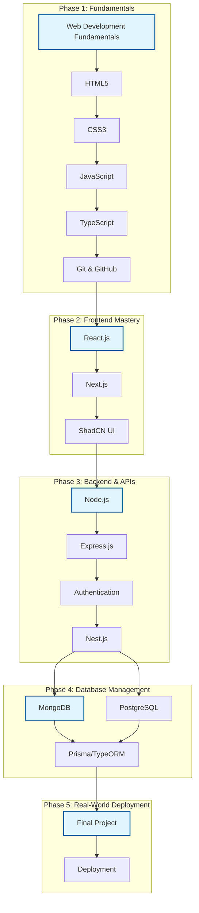

# 🚀 Full-Stack MERN Study Dashboard

Welcome to your personal **MERN Stack Masterclass** study plan. This dashboard is your "Mission Control" for tracking every topic, from HTML basics to advanced NestJS microservices.

## 📊 Overall Progress
| Category | Progress | Topics | Sub Topics |
| :--- | :--- | :--- | :--- |
| Web Development Fundamentals | 0% | 10 | 111 |
| Frontend Development React N | 0% | 6 | 37 |
| Backend Development Nodejs E | 0% | 9 | 57 |
| Databases MongoDB PostgreSQL | 0% | 7 | 51 |

## 🗺️ Visual Learning Map

## 🗺️ Detailed Curriculum

### 📂 Web Development Fundamentals
- [ ] [HTML](MERN_Study_Structure/01_Web_Development_Fundamentals/01_HTML/01_HTML.md)
- [ ] [CSS](MERN_Study_Structure/01_Web_Development_Fundamentals/02_CSS/02_CSS.md)
- [ ] [Bootstrap](MERN_Study_Structure/01_Web_Development_Fundamentals/03_Bootstrap/03_Bootstrap.md)
- [ ] [Tailwind CSS](MERN_Study_Structure/01_Web_Development_Fundamentals/04_Tailwind_CSS/04_Tailwind_CSS.md)
- [ ] [Material UI](MERN_Study_Structure/01_Web_Development_Fundamentals/05_Material_UI/05_Material_UI.md)
- [ ] [Javascript](MERN_Study_Structure/01_Web_Development_Fundamentals/06_Javascript/06_Javascript.md)
- [ ] [Typescript](MERN_Study_Structure/01_Web_Development_Fundamentals/07_Typescript/07_Typescript.md)
- [ ] [Git GitHub](MERN_Study_Structure/01_Web_Development_Fundamentals/08_Git_GitHub/08_Git_GitHub.md)
- [ ] [Tech Stack HTML CSS JavaScript TypeScript Tailwind CSS](MERN_Study_Structure/01_Web_Development_Fundamentals/09_Tech_Stack_HTML_CSS_JavaScript_TypeScript_Tailwind_CSS/09_Tech_Stack_HTML_CSS_JavaScript_TypeScript_Tailwind_CSS.md)
- [ ] [Features](MERN_Study_Structure/01_Web_Development_Fundamentals/10_Features/10_Features.md)

### 📂 Frontend Development React N
- [ ] [Reactjs](MERN_Study_Structure/02_Frontend_Development_React_N/01_Reactjs/01_Reactjs.md)
- [ ] [Nextjs for Full-Stack Development](MERN_Study_Structure/02_Frontend_Development_React_N/02_Nextjs_for_Full-Stack_Development/02_Nextjs_for_Full-Stack_Development.md)
- [ ] [ShadCN](MERN_Study_Structure/02_Frontend_Development_React_N/03_ShadCN/03_ShadCN.md)
- [ ] [Integrating Tailwind Material UI and ShadCN in React Nextjs](MERN_Study_Structure/02_Frontend_Development_React_N/04_Integrating_Tailwind_Material_UI_and_ShadCN_in_React_Nextjs/04_Integrating_Tailwind_Material_UI_and_ShadCN_in_React_Nextjs.md)
- [ ] [Features](MERN_Study_Structure/02_Frontend_Development_React_N/05_Features/05_Features.md)
- [ ] [Features](MERN_Study_Structure/02_Frontend_Development_React_N/06_Features/06_Features.md)

### 📂 Backend Development Nodejs E
- [ ] [Nodejs](MERN_Study_Structure/03_Backend_Development_Nodejs_E/01_Nodejs/01_Nodejs.md)
- [ ] [Expressjs](MERN_Study_Structure/03_Backend_Development_Nodejs_E/02_Expressjs/02_Expressjs.md)
- [ ] [Authentication Authorization](MERN_Study_Structure/03_Backend_Development_Nodejs_E/03_Authentication_Authorization/03_Authentication_Authorization.md)
- [ ] [Advanced Expressjs](MERN_Study_Structure/03_Backend_Development_Nodejs_E/04_Advanced_Expressjs/04_Advanced_Expressjs.md)
- [ ] [NestJS](MERN_Study_Structure/03_Backend_Development_Nodejs_E/05_NestJS/05_NestJS.md)
- [ ] [Building REST APIs](MERN_Study_Structure/03_Backend_Development_Nodejs_E/06_Building_REST_APIs/06_Building_REST_APIs.md)
- [ ] [Database ORM](MERN_Study_Structure/03_Backend_Development_Nodejs_E/07_Database_ORM/07_Database_ORM.md)
- [ ] [Authentication Security](MERN_Study_Structure/03_Backend_Development_Nodejs_E/08_Authentication_Security/08_Authentication_Security.md)
- [ ] [Advanced Topics](MERN_Study_Structure/03_Backend_Development_Nodejs_E/09_Advanced_Topics/09_Advanced_Topics.md)

### 📂 Databases MongoDB PostgreSQL
- [ ] [MongoDB](MERN_Study_Structure/04_Databases_MongoDB_PostgreSQL/01_MongoDB/01_MongoDB.md)
- [ ] [PostgreSQL](MERN_Study_Structure/04_Databases_MongoDB_PostgreSQL/02_PostgreSQL/02_PostgreSQL.md)
- [ ] [CRUD Operations](MERN_Study_Structure/04_Databases_MongoDB_PostgreSQL/03_CRUD_Operations/03_CRUD_Operations.md)
- [ ] [Types of Joins](MERN_Study_Structure/04_Databases_MongoDB_PostgreSQL/04_Types_of_Joins/04_Types_of_Joins.md)
- [ ] [Indexes Performance Optimization](MERN_Study_Structure/04_Databases_MongoDB_PostgreSQL/05_Indexes_Performance_Optimization/05_Indexes_Performance_Optimization.md)
- [ ] [Transactions Advanced Queries](MERN_Study_Structure/04_Databases_MongoDB_PostgreSQL/06_Transactions_Advanced_Queries/06_Transactions_Advanced_Queries.md)
- [ ] [PostgreSQL Advanced Topics](MERN_Study_Structure/04_Databases_MongoDB_PostgreSQL/07_PostgreSQL_Advanced_Topics/07_PostgreSQL_Advanced_Topics.md)

---